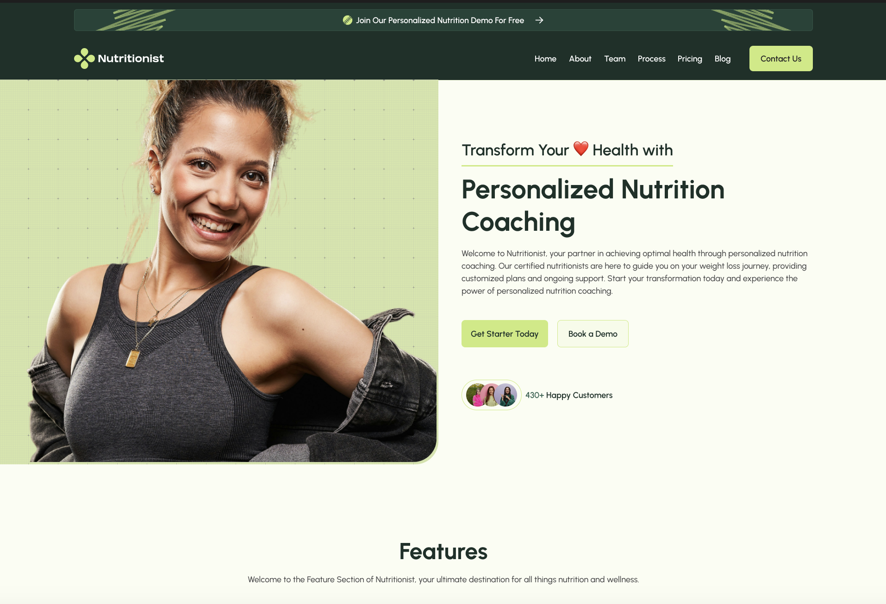

**The Health App**

**Überblick**
The Health App steht für gesunde Ernährung, einen gesundheitsbewussten Lifestyle und dient als mobiler persönlicher Ernährungsberater. Sie ist für jeden verfügbar, der sich für eine achtsamere Lebensweise interessiert und darüber Informationen erhalten möchte bzw. ein für sich abgestimmtes persönliches Coaching in Anspruch nehmen möchte.

Dementsprechend ist das Design in frischen, ansprechenden Farben und klarer Struktur gestaltet worden. Der User erhält dienliche Hinweise und Informationen in kompakten Einheiten. Als besonderes Feauture ist ein Kalorienrechner integriert.

Anhand einer figma-Designvorlage wurde diese Seite von Codingschülerin Lamia (https://github.com/lamianicole) programmiert, um erstes angeeignetes Wissen praktisch umzusetzen.

**Technologien** 
HTML, CSS, Javascript Basiscs

**Vorschau**

